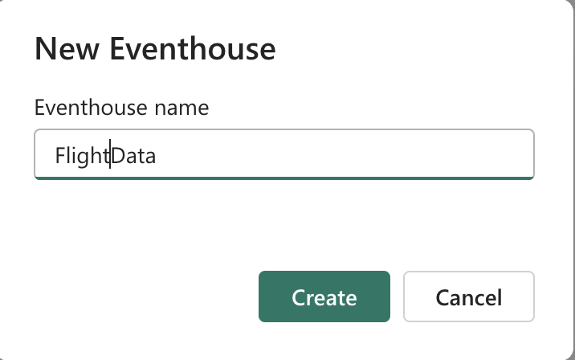
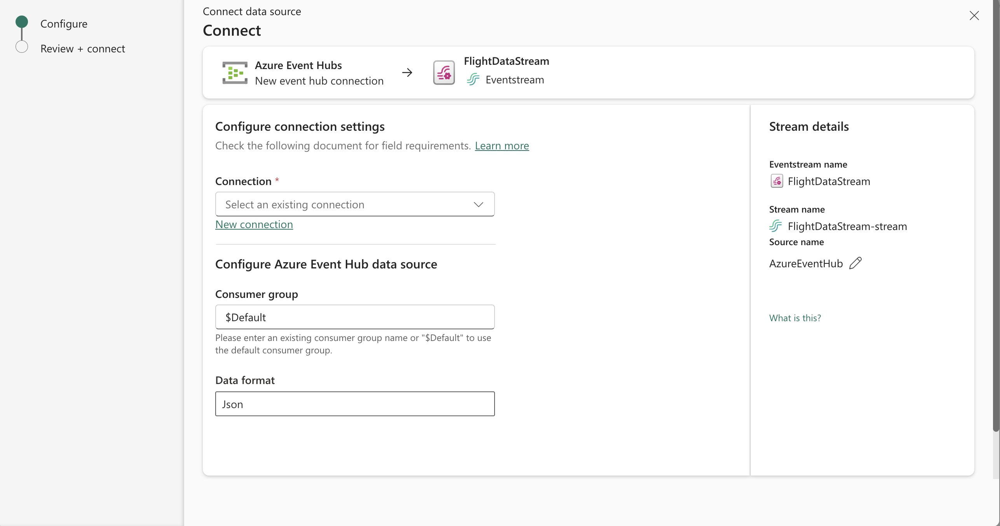
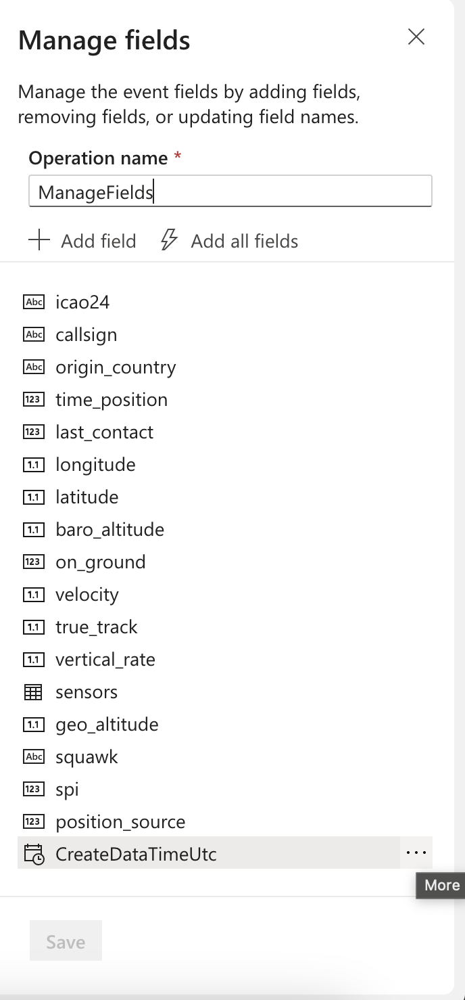

# Ingesting Data into Kusto

*This exercise should take around 30 minutes.*

To start this exercise off you should first create an Eventhouse in Microsoft Fabric. To create an EventHouse navigate to new item and filter by EventHouse.


When asked for a name choose the name *FlightData*.



Within our new EventHouse we'll need to create a new EventStream to get the data we need from the flight tracking event hub. We can either create a new EventStream from the new items menu or directly from the EventHouse. 

In order to do it from the EventHouse navigate to the Home screen and selct the *Get Data* button. 


Select *New EventStream* from the menu and when asked to name this call it *FlightDataStream*.

Choose the Exeternal Sources from the *Add Source* dropdown menu. 


Connect to an Azure Event Hub but change the source name by clicking on the pencil icon and call this to *Flight Source*.



Select create new connection from the new screen. Get the details from your course adviser. These should contain the following:

- Event Hub Namespace 
- Event Hub name 
- Shared Access Key Name
- Shared Access Key 

Leave the *test connection* checkbox checked and press the *Connect* button. If your instructor has given a consumer group name then you should use this otherwise use the *$Default* consumer group. Click the Next button and then Add to add the EventHub source to the 


You should now see the data on the data stream along with the samples of the data set. On this screen we can see source and the destination as well as the transformation.


For now we'll look at how we can be build out the transformation with the following two operations.

- ManageFields 
- GroupBy



From the Transformations dropdown select the *ManageFields* operation. Click on the ellipses and select remove for the following fields:

- EventHubProcessedTimeUtc (Event Hub)
- PartitionId

Also select the ellipses and choose the edit (rename) for *EventHubEnqueuedTimeUtc*. Change the name to *CreateDateTimeUtc*. When complete hit save.

Continue with the next operation which will be to add a rolling count over a 30 second *Tumbling Window*. We will choose add Aggregate and then Count from the dropdown. Make the field **All Rows** selected and name the new aggregation **CountByAircraftOriginCountry**. In the settings dropdown choose *origin_country* and *callsign* and then choose Tumbling Window and enter 30 second into the textbox.    


Now choose *Add Destination* and we'll select the EventHouse that we created earlier. Give this a Destination Name (we'll call this **output**). We'll select our workspace, followed by EventHouse, followed by the KQL Database. At each operation we should see the correct values appear in a dropdown. For *KQL Destination Table* there is a link *create new* which we'll select and call **FlightDataAggRaw**. We'll keep the format JSON from the required dropdown and make sure that the **Activate ingestion after adding data source** checkbox.

We'll also add another output after that we're going to connect to another table and use the connector directly to another output and put all of the raw data into a new Table. As such we'll add another output called **FlightDataRaw** in the same way as the prior table. This time we'll drag the connector from the *Manage Fields* operation to the new *Add Destination* we've just created.

Once this is complete hit the *publish* button in the top left hand corner of the screen. When publishing is complete the dropdown should change to **live**.

We're now going to fkip over to our EventHouse and start using *Kusto Query Language (KQL)* which will allow us query some of the data we've seeing.

First off let's switch to the EventHouse. We should now be able to see something like this which will show us the table, schema and other things in the new table we've ingested.


Choose "New related item" from the top menu and select *KQL Queryset*. In the query pane enter the following:

```php
FlightDataRaw
| take 10
```

This should give the top 10 rows in the order that they are stored in in the table. We'll add another query below this now:

```php
FlightDataRaw
| count
```

This will give us a count of all of the rows in the table so far. Given that we have a stream events that is updated every 30 seconds through our function we should be able to see the count increase every 30 seconds or so.

In order to get all of the flights which started out in the United States we'll filter this from all of the other row values.

```php
FlightDataRaw
| where origin_country == 'United States'
```

We'll group by country to get a view of the number of panes that have left from each country.

```php
FlightDataRaw
| summarize OriginCountryCount = count() by origin_country
```

This is an interesting query but we'll end up with duplicates due to the **call sign** now being in the aggregate clause. 

```php
FlightDataRaw
| summarize OriginCountryCount = count() by origin_country, callsign
| order by OriginCountryCount desc
```

This will also leave the flight data in the right order by the number of call signs (a call sign is an 8 character unique code for the aircraft).


If we move to the results pane and select *Stats* this will give you details of the table on disk.


We're now going to add the following query which will add another column called *NormalisedCountryCount* which will give us a better graphical view of the query.

```kql
FlightDataRaw
| summarize CountryCount = count() by origin_country
| extend NormalizedCountryCount = log10(CountryCount + 1) 
| order by NormalizedCountryCount
```

Looking something like this. If we select **Add Visual** and choose *Column Chart* and Y Columns as *NormalisedCountryCount* and X Column as *origin_country*. 


In the next exercise we'll look to ammending this data through functions, materialised views and update policies.