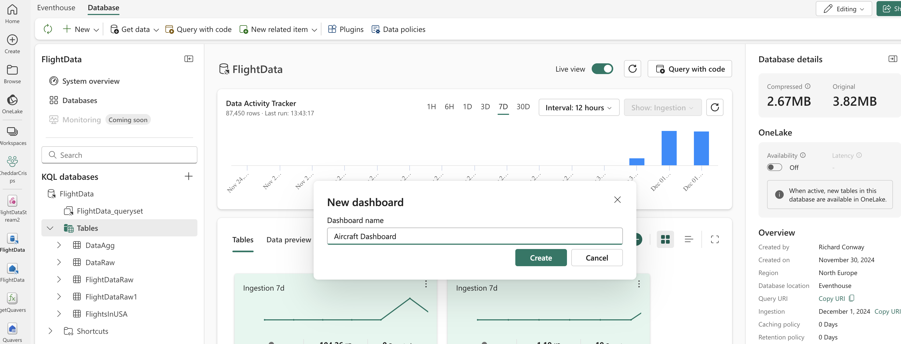
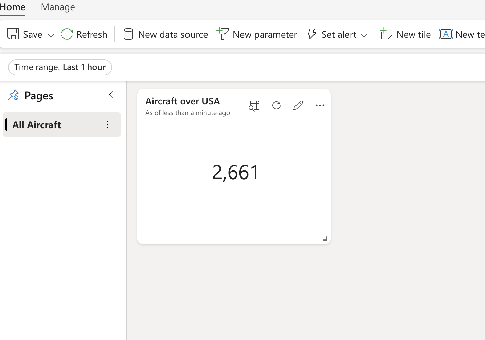
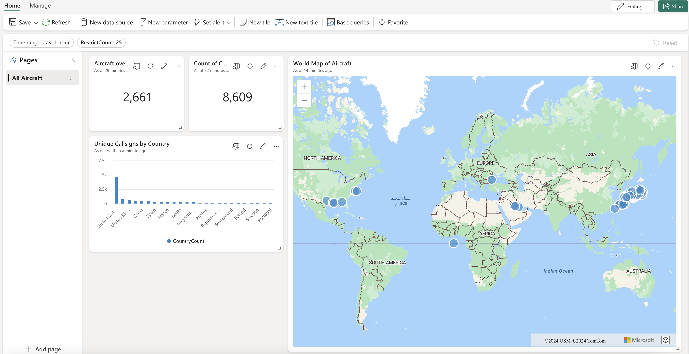
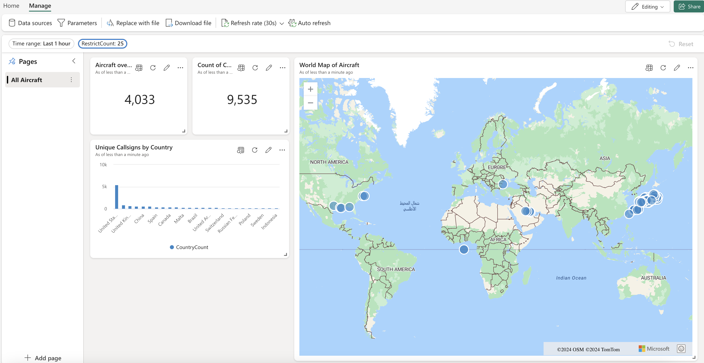

# Building an EventHouse Dashboard

*This exercise should take around 15 minutes.*

You should have completed both exercise 1 and 2. In this exercise we'll be creating a dashboard in EventHouse which can be used to show operational details for all of our planes.

## Creating Dashboard Badges

To start this we'll be clicking on the *New Item* menu option to create a new Real Time Dashboard. When asked for a name we'll call this Aircraft Dashboard.



When the dashboard window pops up we'll rename the page from *Page 1* to *All Aircraft*. We're going to turn this *Stat* instead of a *Table* by ammending in the dropdown box on the right. We'll call this *Aircraft over the USA*. In the query pane we'll add the following:

```kql
FlightsInUSA
| count
```

We'll click on *Apply Changes* now and should see the dashboard like so.



We'll now create another visual on the dashboard. It can be a *Stat* again. We'll add the following query in the query pane.

```kql
FlightDataWithTimestamps
| where LastTimePosition between (_startTime .. _endTime)
| summarize Count = dcount(AirplanCallSign) by AirplanCallSign
| count 
```

This gets us the count of all of the current flights with a call sign. The **_startTime** and **_endTime** parameters are special and can be set from the **Time range** dropdown as in the image.

## Looking at Location data

We're now going to create a map of the world which will contain all of the 100 top fastest planes. To do this we'll click on New Tile from the dashboard page and enter the following query in the query pane:

```kql
GetFlightData()
| project Latitude, Longitude, Velocity
```

We'll add visual and choose Map. Then select define location by Latitude and Longitude from the map. The Latitude column should be set to Latitude and the Longitude column to Longitude and the Label column to Velocity.

We'll call this new tile *World Map of Aircraft*.

## Building a graph

Lastly we'll look at building a graph to show the top number of aircraft by country. We'll select new tile and add visual with a Column Chart this time.

We'll add this query to the query pane:

```kql
FlightDataRaw
| summarize CountryCount = dcount(callsign) by origin_country
| project CountryOfOrigin = origin_country, CountryCount
| order by CountryCount
```

And call the graph *Unique Callsigns by Country*.

We're going to add a parameter from the top pararmeters menu called RestrictCount. In the *New Parameter* window we'll add the following:

- Label = RestrictCount
- ParameterType = "Single Selection"
- VariableName = _restrictCount 
- DataType = int 
- Fixed Values should be 10, 25 and 50 
- Default Value should be 25

We can now ammend the above query to incorporate the parameter.

```kql
FlightDataRaw
| summarize CountryCount = dcount(callsign) by origin_country
| project CountryOfOrigin = origin_country, CountryCount
| order by CountryCount
| limit _restrictCount
```

We can *Apply Changes* and we should end up with a dashboard screen like so:



We're now going to click on *Save* in the top left hand corner of the screen. Now we'll click on *Manage* and then *Auto Refresh*. We'll set the following arguments.

- Enabled = true 
- Minimum time interval = 30 seconds 
- Default time interval = 30 seconds 

Now we'll click on *Apply*. Our dashboard should automatically refresh every 30 seconds.



**Challenge**: Add another graph to show the top n planes with the highest altitude. Use the RestrictCount parameter in your query.