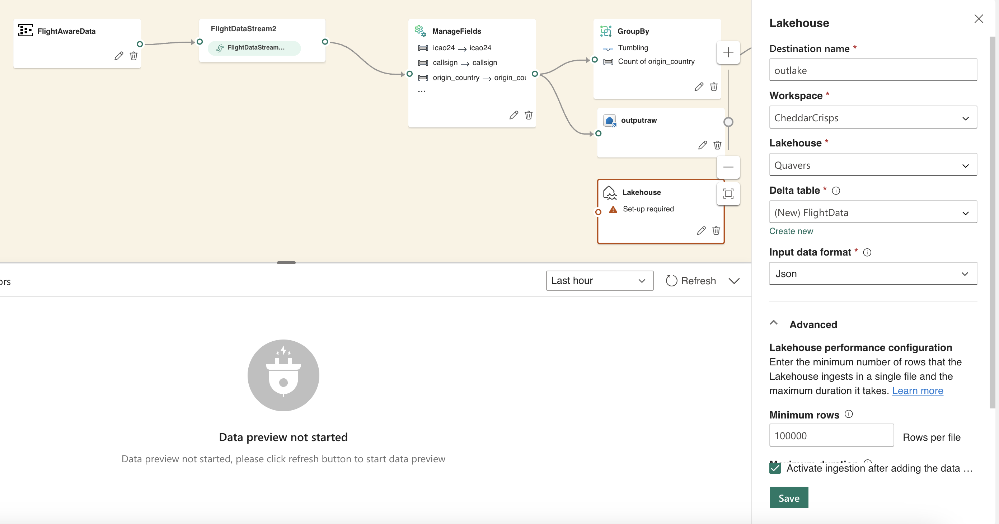
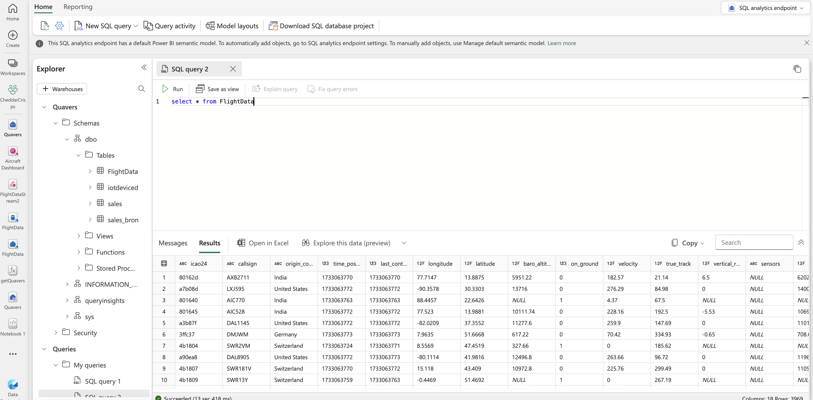

# Building an EventStream with Multiple outputs 

*This exercise should take no more than 15 minutes*

We'll go back to the EventStream that we created earlier and add another destination to send data a lakehouse. If you haven't created a Lakehouse in previous exercise select to create one in your Fabric workspace by selecting Lakehouse and giving it a unique name within the workspace.

In the add destination dropdown in the EventStream select Lakehouse as your destination and choose your workspace, lakehouse and choose to create a new Delta table called *FlightData*. Leave the other defaults as you find them for now.



Click on save now and drag the link from Manage Fields to the Lakehouse. Click on the **publish** button to complete and see your data going into the Lakehouse table. It should take several minutes before data apears.

You should be able to query the table like so:



Enter the following query:

```SQL
SELECT * FROM FlightData
```

**Challenge**: Ammend the EventStream once again to build an aggregate or another operation and then send to another Delta Lake table.