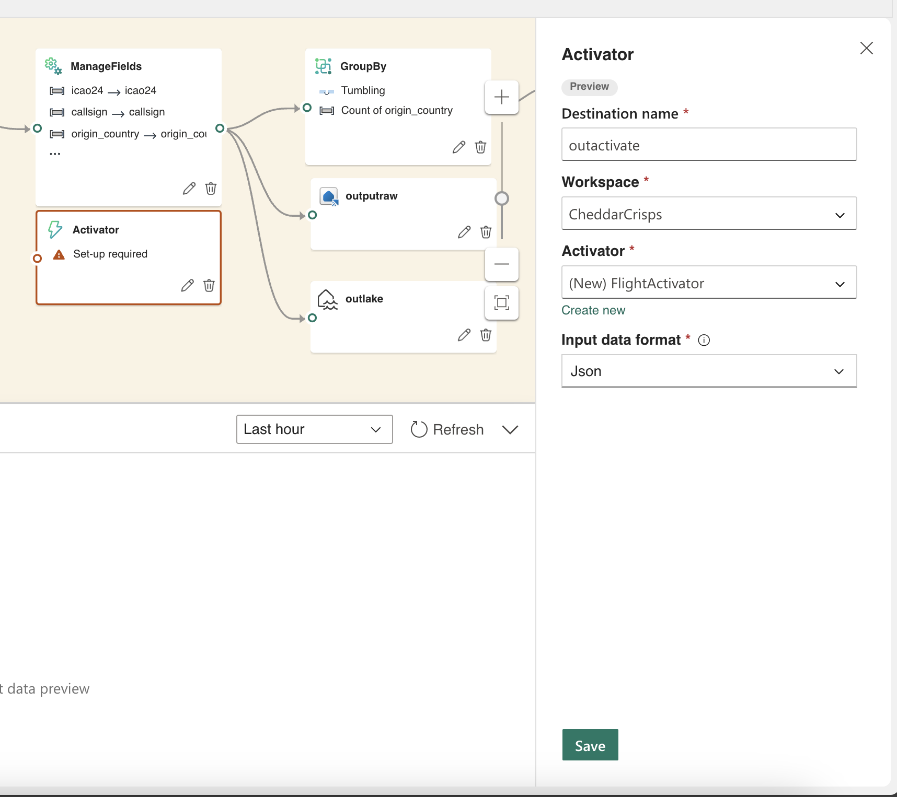
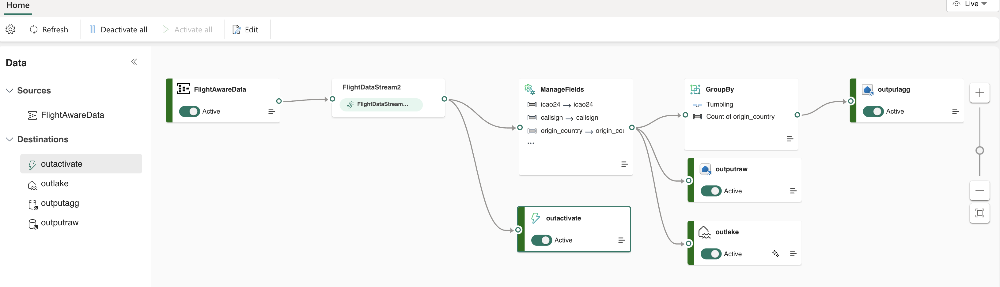
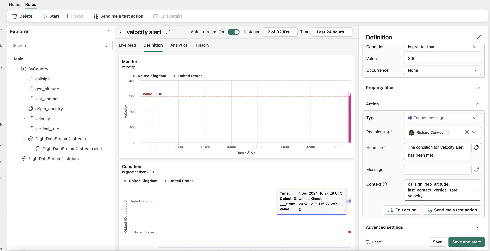
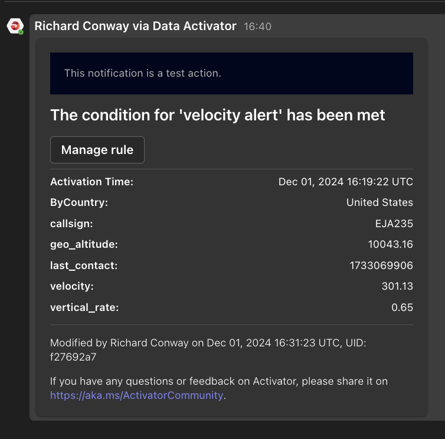
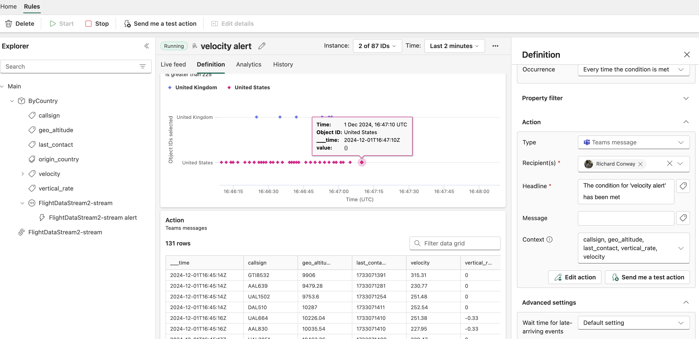

# Alerting with Data Activator 

*This exercise should take no more than 10 minutes*

The Data Activator service allows us to send alerts based on certain business rules, filters and various criteria. We'll be looking at using alerts in a couple of ways in this exercise.

We're going back to our EventStream and will create an Activator from there. It will be lazily created like the Delta table so it might take a few minutes to appear. We'll call it *FlightActivator* and join it to the Direct output of the input stream or the *Manage Fields* activity.

You should have a nice looking EventStreams map of a single EventHub source, 4 destinations and a couple of transformations.

Firstly we're going to group all messages by *origin_country*. In order to this we create an object in the Activator dashboard. From the dropdown menu we'll select a couple of IDs of the countries so that we can see what's going on. You should select *United Kingdom* and *United States*. When this is created select the following properties:

- callsign
- geo_altitude 
- last_contact
- origin_country
- velocity 
- vertical_rate 

For now we're going to monitor velocity. Once this created we should add a rule to the velocity property so that we can monitor it. 

For now we'll create a new rule with the following arguments:

- Attribute = velocity 
- Condition = is greater than 
- Value = 300
- Occurrence = None
- Action Type = Teams message
- Recipient(s) - use your Teams address
- Headline - The condition for 'velocity alert' has been minutes
- Message - leave blank 
- Context - callsign, geo_altitude, last_contact, vertical_rate, velocity

When you've completed this hit the Send Test Message button.

In order to ensure that you can see messages as they appear make sure you change the time period to the last two minutes given the fidelty of the data.

**Challenge**: Use the Data Activator to send test teams messages by using a different object view and set of properties. 