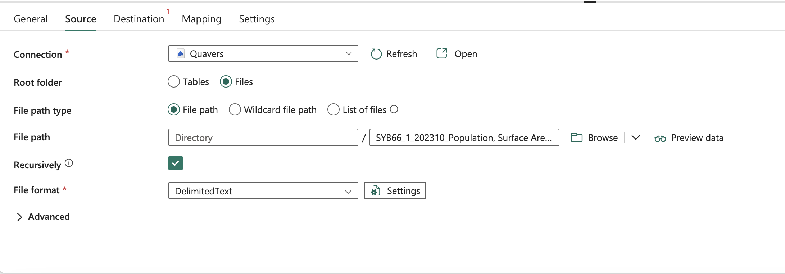
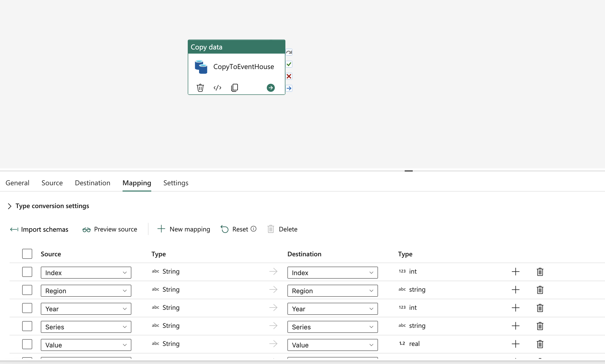

# Reference and Batch with EventHouse 

*This exercise should take no more than 10 minutes*

Whilst EventHouse is considered a real-time database it is also commonly used to deliver and query batch data. Data can be ingested in many ways including custom command line tools and an API. By far the most common way is using Data Pipelines. This exercise will illustrate how to use Data Pipelines to load data on a schedule or as a one-off event.

We're going to be using UN population data and will be looking to join data after the import to see what the ratios between populations and flights are like. To begin with download from the UN website here.

https://data.un.org/_Docs/SYB/CSV/SYB66_1_202310_Population,%20Surface%20Area%20and%20Density.csv

For now we'll upload the file to our LakeHouse so that we can copy it across to EventHouse.


We'll now create a new Pipeline called *CopyToEventHouse*.

Create a new *Copy Activity* and update the source data to read the csv we uploaded from our Lakehouse.



Use the following settings:

- Connection = your Lakehouse
- Root Folder = Files 
- File Path type = File path
- Directory = (none)
- File = SYB66_1_202310_Population, Surface Area and Density.csv
- File Format = Delimited Text

Move back to our KQL Queryset now and enter the following in our EventHouse.

```kql
.create table WorldPopulationRaw (
    Index: int,
    Region: string,
    Year: int,
    Series: string,
    Value: double,
    Footnotes: string,
    Source: string
)
```
This will create the table with the World Population data.



We'll click on *Save and Run* to start the pipeline off.

With all of the data in the table now we're going to run the following query in a queryset to find out what the normalised ration is for flights to population.

```kql
// Step 1: Get the max year and population value for each region
let PopulationByRegion = 
    WorldPopulationRaw
    | where Series == 'Population mid-year estimates (millions)'
    | summarize MaxYear = max(Year) by Region
    | join kind=inner (WorldPopulationRaw) on $left.Region == $right.Region and $left.MaxYear == $right.Year
    | project Region, MaxYear, Population = Value;

// Step 2: Join with FlightDataRaw and calculate FlightRatio
let FlightDataWithRatios = 
    FlightDataRaw
    | join kind=inner (PopulationByRegion) on $left.origin_country == $right.Region
    | summarize PlaneCount = dcount(callsign), Population = max(Population), Year = max(MaxYear) by origin_country
    | extend FlightRatio = PlaneCount / Population
    | project CountryOfOrigin = origin_country, PlaneCount, Population, Year, FlightRatio;

// Step 3: Compute the min and max FlightRatio values
let MaxMinRatios = 
    FlightDataWithRatios
    | summarize MaxFlightRatio = max(FlightRatio), MinFlightRatio = min(FlightRatio);

// Step 4: Normalize FlightRatio between 0 and 1
FlightDataWithRatios
| extend MaxFlightRatio = toscalar(MaxMinRatios | project MaxFlightRatio),
         MinFlightRatio = toscalar(MaxMinRatios | project MinFlightRatio)
| extend NormalizedFlightRatio = round((FlightRatio - MinFlightRatio) / (MaxFlightRatio - MinFlightRatio), 2)
| project CountryOfOrigin, PlaneCount, Population, Year, FlightRatio, NormalizedFlightRatio
| order by NormalizedFlightRatio desc
```

There's a lot going on here. The first two steps do the work however, and the last one computes the distance between the least ratio and the most to create a normalised view. 

Not all country names should match but some should. Here's an example output I get.

| Country               | PlaneCount | Population (millions) | Year | FlightRatio        | NormalizedFlightRatio |
|-----------------------|------------|------------------------|------|--------------------|------------------------|
| Ireland               | 967        | 98.3                  | 2022 | 9.84               | 1.00                   |
| Canada                | 876        | 98.8                  | 2022 | 8.87               | 0.90                   |
| Spain                 | 667        | 96.1                  | 2022 | 6.94               | 0.71                   |
| France                | 591        | 117.2                 | 2022 | 5.04               | 0.51                   |
| Germany               | 1159       | 239.2                 | 2022 | 4.85               | 0.49                   |
| United Kingdom        | 1184       | 278.1                 | 2022 | 4.26               | 0.43                   |
| Austria               | 430        | 108.3                 | 2022 | 3.97               | 0.40                   |
| Sweden                | 256        | 101.6                 | 2022 | 2.52               | 0.26                   |
| Poland                | 316        | 130.2                 | 2022 | 2.43               | 0.25                   |
| Australia             | 235        | 98.6                  | 2022 | 2.38               | 0.24                   |
| Brazil                | 496        | 215.31                | 2022 | 2.30               | 0.23                   |
| Portugal              | 250        | 111.7                 | 2022 | 2.24               | 0.23                   |
| Russian Federation    | 323        | 144.71                | 2022 | 2.23               | 0.23                   |
| Norway                | 189        | 101.9                 | 2022 | 1.85               | 0.19                   |
| Thailand              | 257        | 140.3                 | 2022 | 1.83               | 0.19                   |
| Malaysia              | 188        | 104.5                 | 2022 | 1.80               | 0.18                   |
| Finland               | 156        | 97.7                  | 2022 | 1.60               | 0.16                   |
| Greece                | 148        | 95.8                  | 2022 | 1.54               | 0.16                   |
| Switzerland           | 338        | 218.6                 | 2022 | 1.55               | 0.16                   |
